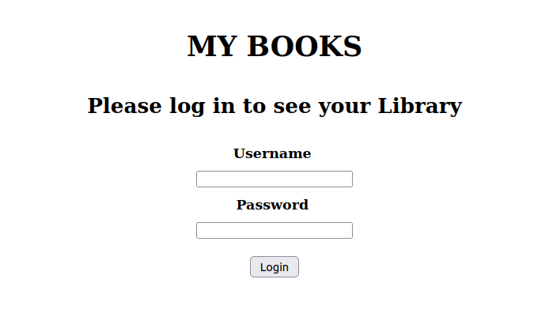
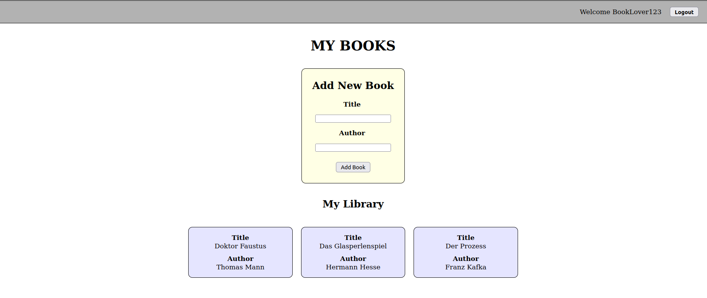
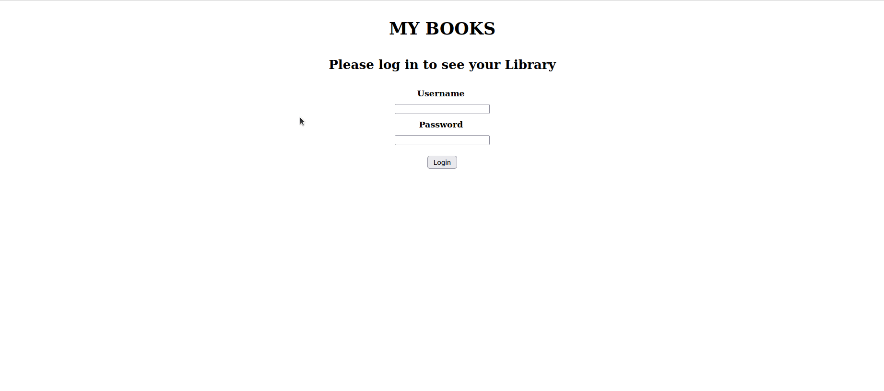
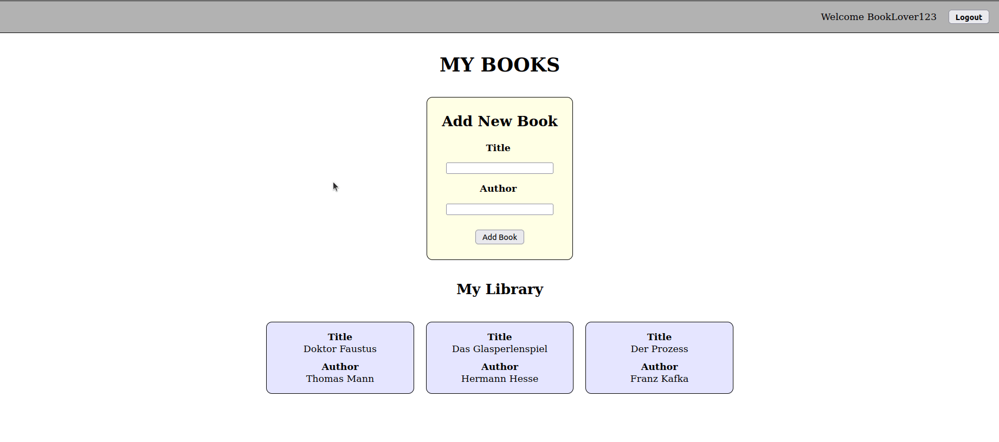
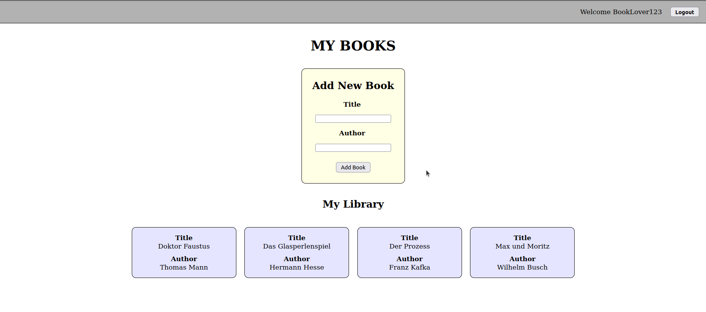

# BE - My Books App

Let's practice everything we have learned about the backend so far to create our first **full-stack** app - a light version of a book cataloguing site.

## Requirements

In this repo you will find two main directories - one for the frontend, one for the backend. Your job is to link them together!

## Data Structure

In your backend directory you will find a data file (`data.js`) containing a `users` array. In this array there is one "user" object, which you will use to complete the steps below.

## Steps

Once you have studied the data file...

### Step 1: Frontend

Practice your React skills by creating a **simple** UI. There is no need to make this look good, unless you have spare time at the end!

(*Note: You can see some sample screenshots below, but you don't have to copy their design if you don't want to.* :smile:)

Your React app should have the following views:

1. **Login** (so the user in the data file can log in)
  - This view should contain a JSX form with **controlled** inputs to enter the user's:
    - Username
    - Password
  - The form must also contain a `button` so the user's login details can be sent in a HTTP request to your backend (see Step 2)

2. **My Books** (if the user has successfully logged in)
  - This view should contain: 
    - A **Navbar** component with a greeting for the user, and logout `button`
    - An **AddBook** component (including a JSX `form`) for the user to add a new book
    - A series of **Book** components, one for each "book" object in the user's `books` array, displaying details of each book

In your React app:
- `App.jsx` should have a state variable called `loggedInUser` (default value: `null`) 
- You should also create state variables in your app for: 
  - The "Login" form (`username` and `password`)
  - The "Add Book" form (`title` and `author`)

Once you have completed your **simple** UI, go to Step 2 to link it to your backend...

---

### Step 2: Connecting the Frontend to a Backend

In the backend directory, create a server using Express. 

Your aim will be to send `fetch` requests from your React frontend, to be handled in your backend. 

Please structure your server in the ways we have discussed, including the following directories:
- `controllers`
- `middleware` (including a global error handler!)
- `routes`

Below are the key use cases from the perspective of your user:

- **Login** 
  - *Frontend*: Fill in the "Login" `form` and click the `button`
  - *Backend*: If successful, the "user" object should be sent back in the server's response
    - Question: What happens if the wrong login data is sent from the frontend? Handle this!
- **Adding a new book**
  - *Frontend*: Fill in the "Add New Book" `form` and click the `button`
  - *Backend*: If successful, a new "book" object (+ UUID id property) should be added to your "user" object's `books` array. The updated "user" object should be sent back in the server's response
    - Question: Can you think of an error case for this use case? Handle it!

You can also handle the user logging out, but in this case you do not need to send a HTTP request to the server

### Reference Images

#### Login

#### Add Book

#### Logout

---

## Bonus Tasks

Please try and complete the above steps by the end of the day. If you have done so, and still have some time left, here are some ideas for additional tasks you could complete to improve this project even more:

- Add backend input validation middleware (if you didn't already)
- Add frontend validation for your forms
- Add extra styling and/or functionality to your React app - see if you can practice some of what we learned in the previous module :smile: