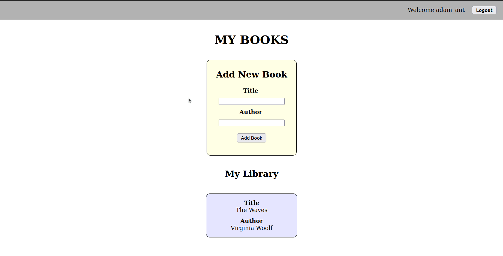

# BE - My Books App + 

Before you start, make sure to create your own `.env` file in the `backend` directory, containing `PORT` and `MONGODB_CONNECTION_STRING` variables. For the latter, you should use your own Atlas connection string (+ "/books-app" at the end).

Please also run your `backend` seed script before you start - this will prove helpful later!

## Requirements

Today we will add extra functionality to the "My Books" app, allowing the user to add new books to their Library.

**Hint:** Try to code as much as you can by yourself. However, if you get stuck at any stage, there may be relevant material in today's "Live Coding" repo. :smile:

---

## Part 1 - Backend

In your **`backend`** directory, you should implement an endpoint to add a book to the user's library. You do not need to make any changes to the `frontend` repo (yet!).

The endpoint should be `PATCH /users/:id/books`.

For now you **only** need to test your changes using **Thunder Client**. Try to achieve the following functionality: 
- In your MongoDB `books-app` collection, add the expected "book" object to the `books` array of the correct "user" document
- If this succeeds, send a response including the user's `id`, `username` and **updated** `books`.

You will also need to update your `login` route to ensure that for a successful login, the user's `id`, `username` and `books` should be sent in the response.

Try to debug any errors you encounter.

Don't forget to add error handling!

Finally, make sure to test all your changes are working as expected before moving on to Part 2.

---

## Part 2 - Frontend

Now you have successfully tested your changes to the backend, let's try and update the frontend to make use of your new functionality.

Right now, using your React app, you can log in as one of the users in `backend/seeder.js`. After doing so, you can see that user's Library, and also log out. 

If you are successful in this Task, you will also be able to add books to a user's library using the "Add New Book" `form`.

**Hint:** Thanks to Part 1, you should already have created an endpoint in your backend to achieve this functionality. Your job is now to correctly send HTTP requests to those endpoints, and handle the response

Again, don't forget to implement error handling in the frontend, so your user can receive relevant error messages.

### Reference Image:

---

## Bonus

If you finish early, feel free to see if you can add extra functionality to this project in whatever way seems good to you.

Alternatively, you are welcome to practice React styling by making your frontend look better. :smile: