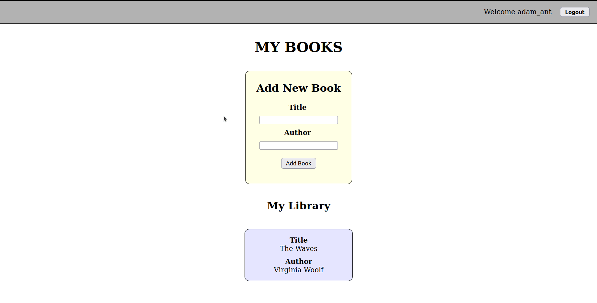

# BE - My Books App + Relationships

Before you start, make sure to create your own `.env` file in the `backend` directory, containing `PORT` and `MONGODB_CONNECTION_STRING` variables. For the latter, you should use your own Atlas connection string (+ "/books-app" at the end).

Please also run the `backend` seed script before you start!

## Requirements

Today we will add a new `Book` model to the project, and create a relationship between the `users` and `books` collections in your MongoDB database.

**Hint:** Try to code as much as you can by yourself. However, if you get stuck at any stage, there may be relevant material in today's "Live Coding" repo. :smile:

---

## Part 1 - Backend

1. In your **`backend`** directory, you should create a new `Book` model. The model's schema should allow for the following fields:

- title (String)
- author (String)

2. When you are done, you should create and test a new endpoint: `POST /books`.
- If a JSON object with properties `title` and `author` are received in the request body, a new "book" document should be created and inserted into the `books` collection
- If the request succeeds, you should send a JSON object in the server's response with an `id` property, with the new "book" document's `_id` as its value
- For now, you should test your new endpoint with **Thunder Client**. 
- Also check your Atlas database to make sure you are creating the expected documents in your `books` collection

3. Next, you should **edit** your `addNewBook` controller function in `controllers/usersController.js`. 
- First, you will need to edit the `User` model's schema, so that each "user" document's `books` array is set to contain **`ObjectIds`** only!
- The function should receive a JSON object with property `bookId` in the request body.
- The function should use its `:id` param to **find and update** a "user" document by **pushing** the `bookId` value (received in the request body) into the user's `books` array
- You **do not** need to edit the response sent to the frontend if the request is successful. You also **do not** need to edit any of the `next` function calls in case of an error
- Don't forget to add error handling!

1. Test your `PATCH users/:id/books` endpoint (which uses the controller function in Task 3) with **Thunder Client**. 
- When testing your controller function, make sure that: 
  - The `bookId` value in the request body is a **valid** `id` for one of your existing "book" documents
  - The `:id` param is a **valid** `id` for one of your existing "user" documents
- If the request succeeds, you should receive up-to-date data for your user with the following properties:
  - id (a string)
  - username (a string)
  - books (an array of ids)

1. If everything is working so far, try to add a `ref` to your `User` model to create a relationship with the `Books` model

2. Finally, try to update the `addNewBook` controller function once again, to **populate** the user's `books` array before sending the success response
- Test the `PATCH users/:id/books` endpoint once again with **Thunder Client**. You should get back the same kind of response as in Task 3, but the `books` array should now contain objects with the correct `title` and `author` data

---

## BONUS - Part 2 - Frontend

If everything is working so far, and you still have some time left...

... In your **frontend**, you should try and update the `handleAddBook` function in `components/AddBook.jsx`.

This should use your changes from **Part 1** to do the following:
- When the user submits a HTTP request to the backend to add a new book, that book should be added as a document to the `books` collection
- If this succeeds, the logged in user should next have the `id` of the new book document added to their own document's `books` array (in the `users` collection)
- If this succeeds, the server should send back useful data about each book in the user's `books` array (thanks to population!), which you can use to update the React app to show the user their Library in the same way as before

## Reference Image for Part 2:

